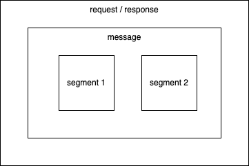
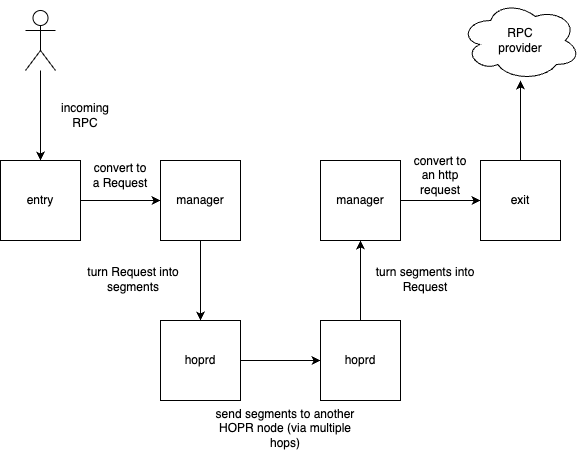

# RPCh

RPCh is an application you can run alongside your [HOPRd node](https://docs.hoprnet.org/v1.85/about-hopr) which can act as both an entry and exit RPC provider.

## How it works

Once RPCh connects to a running HOPRd API, it will listen for incoming RPC requests and relay them to another running RPCh through the HOPR network.


## Getting started

### Environment Variables

| variable                    | description                                                       |
| :-------------------------- | :---------------------------------------------------------------- |
| ENTRY_PORT                  | the port in which the client will send RPC requests               |
| HOPRD_API_ENDPOINT          | api endpoint of HOPRd                                             |
| HOPRD_API_TOKEN             | api token of HOPRd                                                |
| RESPONSE_TIMEOUT (optional) | how many ms before we stop waiting for a response, default: 10000 |

### Connecting to an existing HOPRd API

If you have an already running HOPRd node, you can simply adjust the environment variables in order for RPCh to start processing RPC requests.

```terminal
yarn build

DEBUG="hopr*,-*verbose" \
    ENTRY_PORT=3000 \
    HOPRD_API_ENDPOINT= \
    HOPRD_API_TOKEN= yarn start
```

### Using a simulated environment via devkit

The DevKit is a Docker Compose based approach of having a complete hoprd network
and RPChs running locally which is useful for development.

To achieve that the DevKit relies on HOPR Pluto, a pre-built HOPR network which
has 5 nodes running fully interconnected. On top of that each node has a HOPR
RPC Relay instance running alongside it and is configured to use that particular
node. A developer can then use the RPCh Entry API as normal and have
it being relayed locally fully-functional.

#### Run DevKit

As a shorthand one can run the DevKit by executing:

```
RELAY_VERSION=v0.0.1 make devkit-run
```

This will create and launch all required Docker containers. After a few minutes
the pluto container will print out access information for the hoprd nodes.

The RPCh instances can be reached individually over the following
endpoints once launched:

```
http://localhost:9001
http://localhost:9002
http://localhost:9003
http://localhost:9004
http://localhost:9005
```

### Connecting your client

In order for your client (ex: wallet like [MetaMask](https://metamask.io/)) to be able to send RCP requests to RPCh, you will need to change the RPC Url endpoint in the client's settings to point to the one running locally on your machine.
Additionally, you will need to specify a `exit-provider` as part of the URLs parameters, for example:

```
http://localhost:9001/?exit-provider=https://primary.gnosis-chain.rpc.hoprtech.net
```

## Disclaimer

RPCh is build to primarily help facilitate our upcoming hackathon and is not meant to be used in production.
Additionally, RPCh is an application which implements novel concepts such as segmentation on-top of the HOPR protocol. In the coming future, segmentation will be handled by the HOPR protocol.

## Architecture

RPCh is able to act both as an entry node (incoming RPC requests) and an exit node (creating requests to the RPC provider). With this design in mind, the application, once run, it can facilitate both incoming and outgoing requests.

Currently, HOPR nodes can only accept messages under 500 bytes. As RPC requests can be an arbitrary number, the message needs to be split into 500 byte chunks.

In the following diagram, it shows how Request and Response messages are constructed.



To help bring everything together, here is a diagram of how a Request is created and delivered to the exit node.


